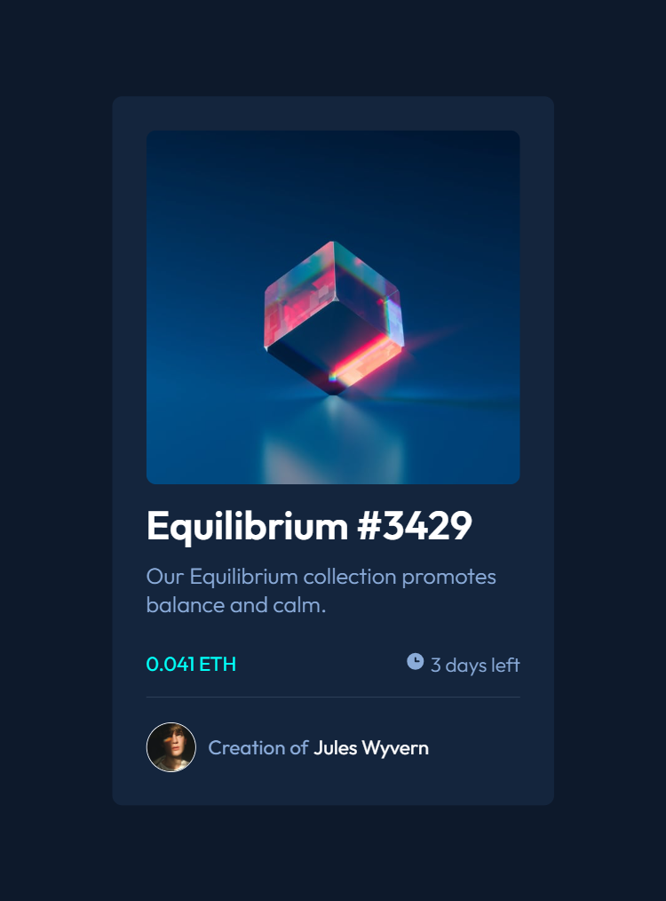
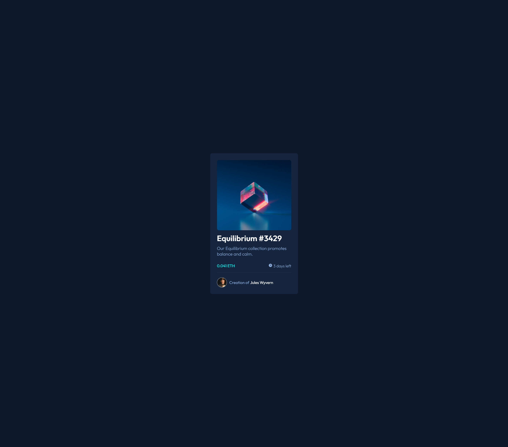

# Frontend Mentor - NFT preview card component solution

This is a solution to the [NFT preview card component challenge on Frontend Mentor](https://www.frontendmentor.io/challenges/nft-preview-card-component-SbdUL_w0U). Frontend Mentor challenges help you improve your coding skills by building realistic projects.

## Table of contents

- [Overview](#overview)

  - [The challenge](#the-challenge)
  - [Screenshot](#screenshot)
  - [Links](#links)
  - [Built with](#built-with)
  - [What I learned](#what-i-learned)
  - [Continued development](#continued-development)
  - [Useful resources](#useful-resources)

- [Author](#author)

## Overview

This HTML & CSS only challenge is perfect for anyone just starting out or anyone wanting a small project to play around with.

### The challenge

Users should be able to:

- View the optimal layout depending on their device's screen size
- See hover states for interactive elements

### Screenshot

### Links

- Solution URL: [Preview Code](https://github.com/remainhumble/NFT-preview-card-component)
- Live Site URL: [Live site](https://remainhumble.github.io/NFT-preview-card-component/)

### Built with

- Semantic HTML5 markup
- CSS custom properties
- Flexbox

### What I learned

-View the optimal layout depending on their device's screen size
-See hover states for interactive elements

### Continued development

CSS Methodologies and architectures

### Useful resources

- [BEM in 6 minutes - CSS Methodology 2024](https://www.youtube.com/watch?v=xaXmoVZ3koo) - In this video, you will learn about BEM methodology, which is a CSS naming convention for HTML and CSS to keep your code maintainable.

## Author

- Frontend Mentor - [@remainhumble](https://www.frontendmentor.io/profile/remainhumble)
- X(formerly Twitter) - [@thiflan120699](https://x.com/thiflan120699)
